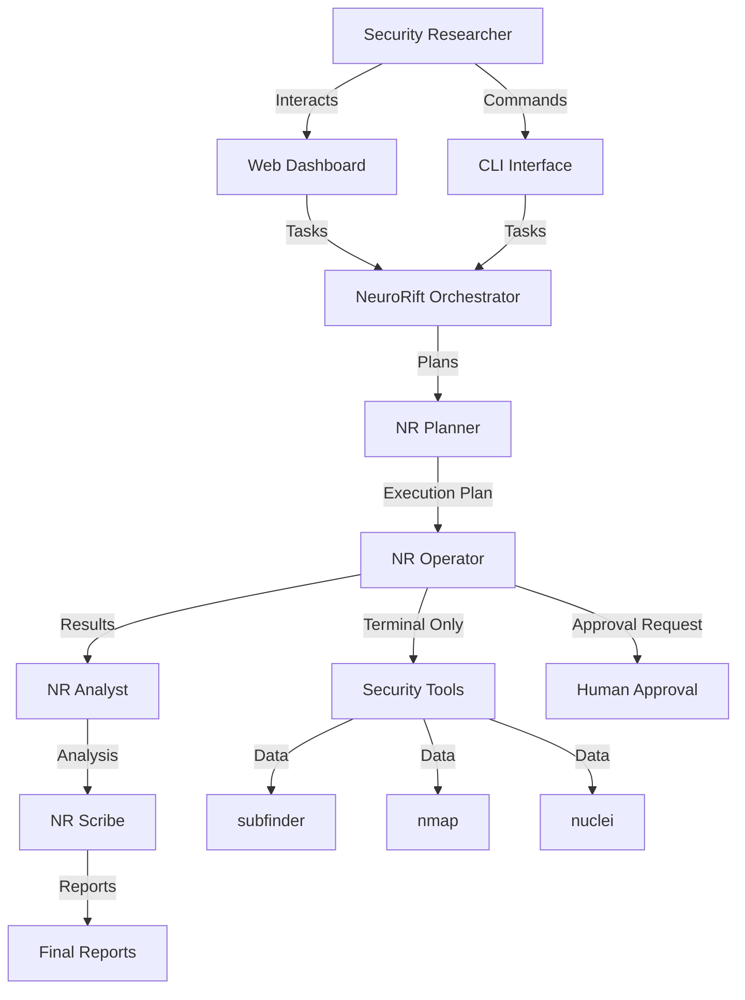

# 🧠 NeuroRift: Terminal-Based Multi-Agent Intelligence System

[](LICENSE)
[](https://www.python.org/)
[](https://github.com/demonking369/NeuroRift)
[](https://github.com/demonking369/NeuroRift)

> **"Intelligence amplified through orchestrated AI agents."**

**Designed and developed by demonking369**

> [!IMPORTANT]
> **🚧 THIS PROJECT IS CURRENTLY IN ACTIVE DEVELOPMENT (BETA Phase) 🚧**
>
> While the core features are functional, you may encounter bugs or incomplete features. We are actively shaping the future of this tool.

---

## 📖 Table of Contents
- [Overview](#-overview)
- [Architecture](#-architecture)
- [Key Features](#-key-features)
- [Installation Guide](#-installation-guide)
- [Usage Manual](#-usage-manual)
- [Configuration](#-configuration)
- [Credits & Thanks](#-credits--thanks)
- [Disclaimer](#-legal-disclaimer)

---

## 🔭 Overview

**NeuroRift** is a terminal-based multi-agent intelligence system designed for authorized security research and penetration testing. The framework employs specialized AI agents that work in concert to plan, execute, analyze, and report on security operations with unprecedented precision.

Unlike traditional security tools, NeuroRift leverages **Local Large Language Models (LLMs)** through an orchestrated multi-agent architecture where each agent has a distinct role:

- **NR Planner**: Strategic planning and task decomposition
- **NR Operator**: Terminal-based execution with human-in-the-loop controls
- **NR Analyst**: Advanced vulnerability analysis with CVSS scoring
- **NR Scribe**: Professional multi-format report generation

The framework unifies industry-standard tools (`nmap`, `nuclei`, `subfinder`) into a cohesive, modular platform accessible via a modern Web Dashboard or a powerful Command Line Interface (CLI).

---

## 🏗️ Architecture

NeuroRift is built on a multi-agent orchestration architecture with strict operational discipline:



---

## 🚀 Key Features

### 1. **Multi-Agent Orchestration**
*   **NR Planner**: Creates strategic execution plans with task decomposition and risk assessment
*   **NR Operator**: Executes commands exclusively through terminal with mandatory human approval for external actions
*   **NR Analyst**: Performs advanced vulnerability analysis with CVSS 3.1 scoring and false positive reduction
*   **NR Scribe**: Generates professional reports in multiple formats (Markdown, JSON, HTML, PDF)

### 2. **Mode Governor**
*   **OFFENSIVE Mode**: Research and discovery operations (reconnaissance, scanning, vulnerability assessment)
*   **DEFENSIVE Mode**: Analysis and mitigation operations (vulnerability analysis, patch recommendations, hardening)
*   **Strict Separation**: No cross-mode contamination, tool access controlled per mode
*   **Violation Logging**: All mode violations are logged and reported

### 3. **Human-in-the-Loop Controls**
*   **Required Approval**: Browser navigation, external API calls, file modifications
*   **Timeout Handling**: Configurable timeout with default deny on timeout
*   **Audit Trail**: Complete logging of all approval requests and responses

### 4. **Task State Memory**
*   **Persistent Storage**: All task state saved to disk
*   **Checkpoint/Resume**: Automatic checkpoints every 5 minutes
*   **Execution History**: Complete history of all operations
*   **Context Preservation**: Agent context maintained across sessions

### 5. **Advanced Reconnaissance Engine**
*   **Full-Spectrum Discovery**: Automated workflow chaining subdomain enumeration (`subfinder`), port scanning (`nmap`), and technology profiling (`whatweb`)
*   **Vulnerability Assessment**: Integrated `nuclei` scanning for rapid identification of known security flaws
*   **Stealth Mode**: Configurable rate limiting and passive scan options to minimize detection risk

### 6. **Dark Web Intelligence (Robin Integration)**
*   **Tor-Native**: Built-in routing via Tor SOCKS proxy for safe interaction with `.onion` services
*   **Semantic Search**: Uses AI to refine search queries and filter results
*   **Automated Scraping**: Safely extracts and summarizes content from hidden services

---

## 📦 Installation Guide

### **Prerequisites**
*   **Operating System**: Linux (Kali Linux or Ubuntu 22.04+ recommended)
*   **Python**: Version 3.10 or higher
*   **Tor**: Required for Dark Web functionality
    ```bash
    sudo apt update && sudo apt install tor -y
    sudo systemctl enable --now tor
    ```
*   **Ollama**: Required for AI features. [Download Ollama](https://ollama.com).

### **Step-by-Step Setup**

1.  **Clone the Repository**
    ```bash
    git clone https://github.com/demonking369/NeuroRift.git
    cd NeuroRift
    ```

2.  **Run the Unified Installer**
    ```bash
    # Handles all dependencies (Rust, Python, Node.js, Security Tools)
    bash install_script.sh
    ```

3.  **Configure AI Models (Optional)**
    ```bash
    # Launch interactive configuration wizard
    source .venv/bin/activate
    ./neurorift_main.py --configure
    ```

---

## 🎯 Usage Manual

### **Mode A: Web Dashboard (Recommended)**
```bash
neurorift --webmod
```
*   **Access**: Open your browser to `http://localhost:8501`
*   **Features**: Full graphical control over all modules, real-time logs, and interactive reports

### **Mode B: NeuroRift Intelligence Mode (Orchestrated)**

**OFFENSIVE Mode (Discovery):**
```bash
neurorift --orchestrated --mode offensive -t example.com
```

**DEFENSIVE Mode (Analysis):**
```bash
neurorift --orchestrated --mode defensive --analyze results/scan.json
```

**Resume Interrupted Task:**
```bash
neurorift --resume task_20260124_092347
```

### **Mode C: Command Line Interface (CLI)**

**Standard Recon Scan:**
```bash
neurorift -t example.com --operation-mode recon
```

**Dark Web Search:**
```bash
neurorift darkweb --query "leaked credentials example.com"
```

---

## 🔧 Configuration

NeuroRift utilizes a centralized configuration file at `configs/neurorift_config.json`:

```json
{
  "agents": {
    "planner": { "max_planning_iterations": 3 },
    "operator": { "max_retries": 3 },
    "analyst": { "confidence_threshold": 0.7 }
  },
  "mode_governor": {
    "allow_mode_switching": false,
    "log_violations": true
  },
  "human_in_the_loop": {
    "timeout_seconds": 300,
    "default_on_timeout": "deny"
  }
}
```

| Variable | Description | Default |
| :--- | :--- | :--- |
| `AI_ENABLED` | Master switch for AI features | `true` |
| `OLLAMA_MAIN_MODEL` | Primary LLM for complex reasoning | `llama3.2` |
| `OLLAMA_ASSISTANT_MODEL` | Faster LLM for chat interactions | `llama3.2` |
| `ROBIN_TOR_PROXY` | SOCKS proxy for Dark Web traffic | `socks5h://127.0.0.1:9050` |
| `LOG_LEVEL` | Application logging verbosity | `INFO` |

---

## ⚠️ Legal Disclaimer

**NeuroRift is purpose-built for AUTHORIZED security testing, red teaming, and educational research.**

*   **Authorization Required**: You must have explicit, written permission from the owner of any system you scan or test.
*   **Compliance**: Users are responsible for complying with all applicable local, state, and federal laws.
*   **Liability**: The developer of NeuroRift is not liable for any misuse, damage, or illegal activities resulting from the use of this software.

---

## 🎖️ Credits & Thanks

**NeuroRift is independently developed by demonking369.**

The following open-source projects were used as references or components, and are gratefully acknowledged:

### Referenced Projects
- **[x1xhlol/system-prompts-and-models-of-ai-tools](https://github.com/x1xhlol/system-prompts-and-models-of-ai-tools)** - System prompt patterns and AI agent design references
- **[SimStudioAI](https://simstudio.ai)** - Conceptual orchestration design inspiration

### Core Dependencies
- **[Ollama](https://ollama.com)** - Local LLM inference engine
- **[ProjectDiscovery](https://projectdiscovery.io)** - Security tools (subfinder, nuclei, httpx)
- **[Nmap](https://nmap.org)** - Network scanning and service detection
- **[Streamlit](https://streamlit.io)** - Web dashboard framework
- **[Rich](https://rich.readthedocs.io)** - Terminal UI library

### Special Thanks
- The open-source security community for continuous innovation
- All contributors who have helped improve NeuroRift
- The AI research community for advancing LLM capabilities

> **Thanks to the open-source projects that inspired and supported NeuroRift.**

---

## 📚 Documentation

- **[NeuroRift Intelligence Mode](docs/NEURORIFT_README.md)** - Complete multi-agent orchestration guide
- **[Agent Roles](docs/AGENT_ROLES.md)** - Detailed agent capabilities and responsibilities
- **[Migration Guide](docs/MIGRATION_GUIDE.md)** - Upgrading from legacy modes

---

## 🤝 Community & Support

*   **GitHub Issues**: [Report Bugs & Request Features](https://github.com/demonking369/NeuroRift/issues)
*   **Documentation**: [Full Documentation](https://github.com/demonking369/NeuroRift)

---

**Designed and developed with ❤️ and ☕ by demonking369**

**NeuroRift** - Intelligence amplified through orchestrated AI agents.
